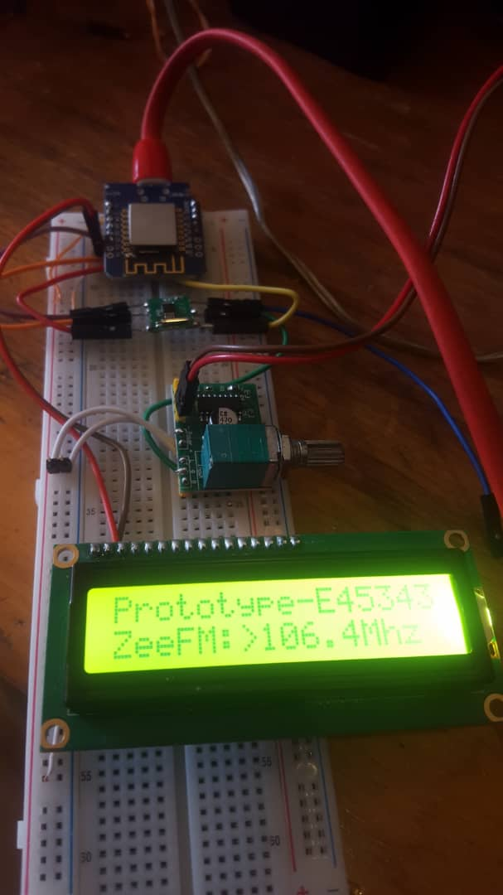

# ESP8266-RDA5807 WiFi FM Radio

- This project combines an ESP8266, an RDA5807 FM-AM radio module, an Audio Amplifier module  and an SD1306 OLED display to create an FM radio that can be controlled over a local WiFi network. 
- It includes  HTTP endpoints for changing radio channels (but other features can be exposed to via the endpoints), making it suitable for integration with home automation systems.

## Note
- I didnt have images of the OLED-Display version of the project 
- so I used images from an LCD-Display version of the project

## Hardware Components

- **ESP8266**: This microcontroller is the heart of the project and manages the radio module, display, and WiFi connectivity.
- **RDA5807 FM-AM Radio Module**: It receives and plays FM radio stations.
- **SD1306 OLED Display**: This display provides station frequency.
- **16X2 LCD Display**: Can be used to as a display (but driver code is not included in this project)

## Features

- Creates a small soft Wifi Access Point (but can be programmed to be a client)
- Display selected or current station frequency
- Plays and outputs audio to a speaker 
- Suitable for integration with home automation systems.

## Project Structure

The project is organized into several parts:

- **Initialization**: The project initializes the OLED display, the radio module, and WiFi connectivity.
- **Main Loop**: The main loop handles HTTP requests, allowing users to switch between radio stations.
- **HTTP Server**: The ESP8266 runs an HTTP server with endpoints for next and previous station selection.
- **OLED Display**: The OLED display functions are used to show station information on the screen.
- **Radio Configuration**: The code initializes and configures the RDA5807 radio module.
- **Station Array**: An array holds the frequencies of radio stations.
- **Radio Control Functions**: Functions control the radio module and the selection of radio stations.
- **Setup and Loop**: The setup function initializes components, while the loop function manages server requests and display updates.

## Usage

1. Configure the ESP8266 with the appropriate software.
2. Connect the OLED display and the RDA5807 radio module to the ESP8266.
3. Upload the code to the ESP8266.
4. Power on the ESP8266.
5. Connect your device to the local WiFi network named "MY-FM-RADIO" with the password "qwertyuiop".
6. Open a web browser and access the ESP8266's IP address to control the radio.

## Dependencies

The project relies on the following libraries:

- **RDA5807M.h**: A library for controlling the RDA5807 FM-AM radio module.
- **ESP8266WiFi.h**: For WiFi connectivity.
- **ESP8266WebServer.h**: For creating HTTP endpoints.
- **U8g2lib.h**: A library for controlling the OLED display.

## Note

- Ensure the correct wiring and connections of the hardware components.
- The default station count is set to 4; you can modify it to match your requirements.
- The WiFi network name and password are defined as "MY-FM-RADIO" and "qwertyuiop" respectively; you can change them as needed.
